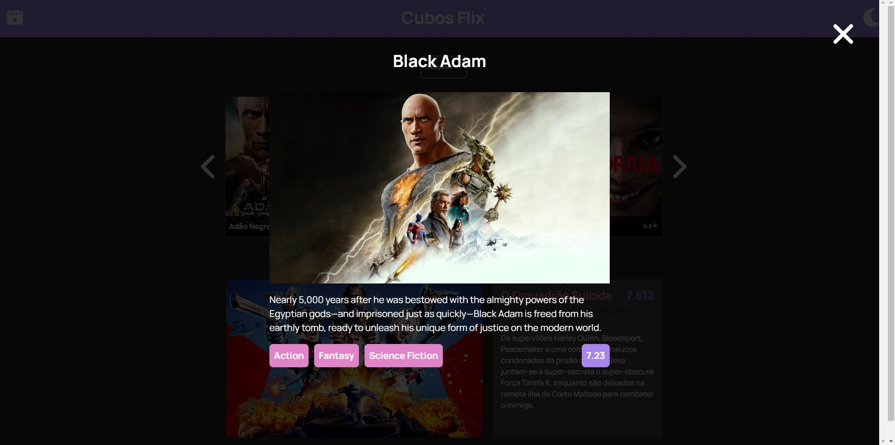

# Site de streaming de vídeo

## Um site simples com informações de filmes, seus posteres e suas sinopses.

### Características do projeto

- Site com lógica em javascript puro, com DOM.
- Consumo de API externa para a obtenção dos dados dos filmes.
- Paginação da lista de filmes.
- Modal de detalhamento do filme após clique em seu respectivo poster, com tags de gênero.
- Parte da estrutura html foi gerado dinâmicamente, através do javascript.

## Tela home

## Modal de sinopse de filme

## Como visualizar o projeto localmente:
    - Baixe o repositório localmente
    - Simplesmente execute o arquivo "index.html" no seu navegador

### Obrigado pela boa vontade